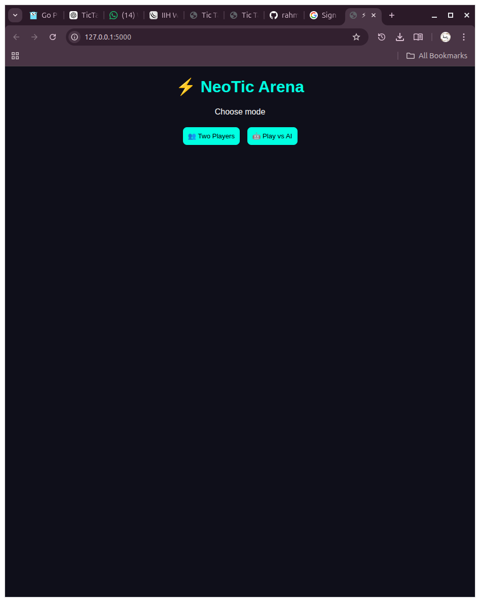
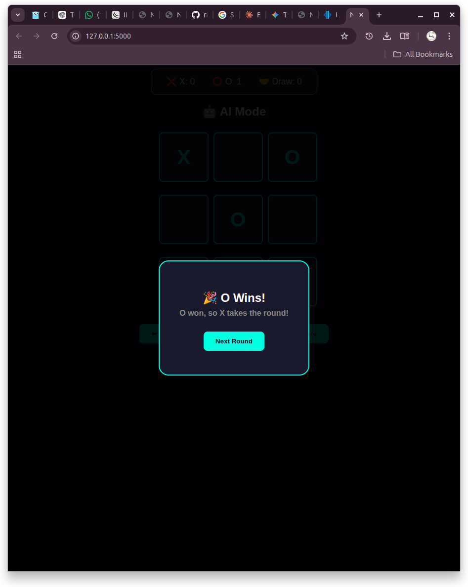
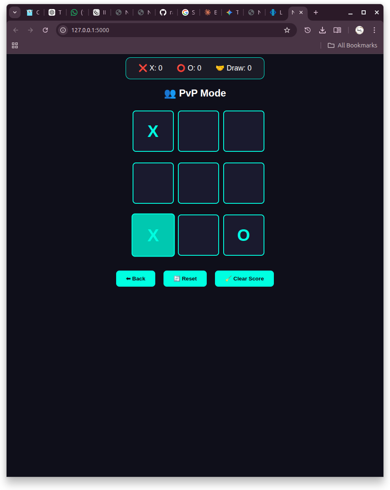
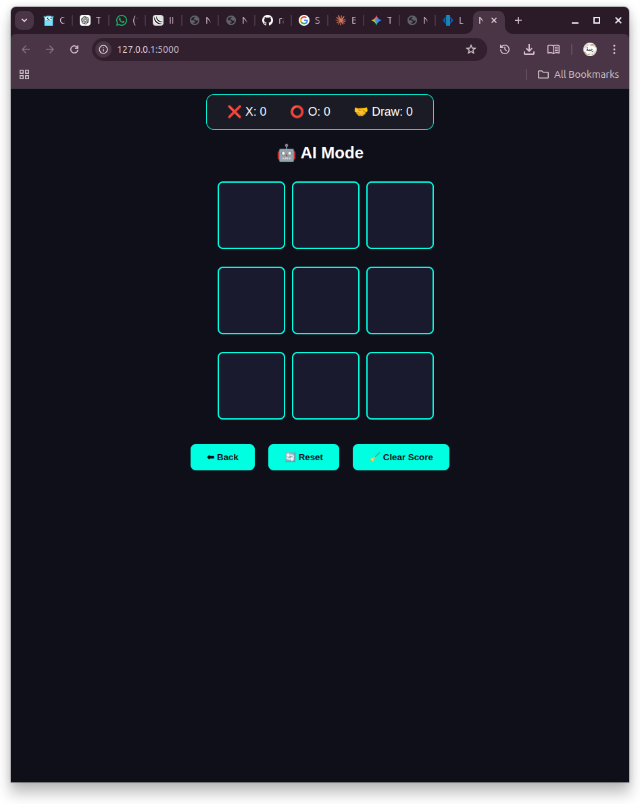

# ⚡ NeoTic Arena (Python + Flask + JavaScript AI)

A sleek, modern browser-based Tic-Tac-Toe game featuring a **Flask (Python backend)** and an asynchronous **JavaScript frontend**. This version includes intelligent turn-management, AI "thinking" delays, and a persistent scoreboard.

## NeoTic Arena :- 
*“A modern battle arena for Tic-Tac-Toe”* or
> *“A futuristic Tic-Tac-Toe game zone”*

## Updated Features

* **Intelligent AI:** Powered by a backend decision engine that blocks players and takes winning moves.
* **Fair-Play Starter Logic:** The loser of the previous round is designated the `next_starter`. If the AI is starting, it plays automatically after a short delay.
* **Dual-Reset System:** * **Next Round:** Clears the board via the winner popup but preserves your match scores.
    * **Full Reset:** Hard resets the entire arena, wiping scores and returning the starter to Player X.
* **Async AI Feedback:** Features a "Thinking..." indicator to make playing against the AI feel more natural.
* **Persistent Scoreboard:** Tracks wins for X, O, and Draws without page refreshes.
* **Zero-Reload Navigation:** Switch between PvP and AI modes instantly via the backend mode-setter.

## Tech Stack

* **Backend:** Python 3.12+ (Flask)
* **Frontend:** HTML5, CSS3 (Neon-Dark Theme), JavaScript (ES6+ Async/Await)
* **Communication:** RESTful JSON API

## Project Structure

```text
TicTacToe-python-game/
│
├── app.py              # Flask Server, Winner Logic & AI Brain
├── static/
│   ├── style.css       # Custom Neon Styles
│   └── script.js       # Frontend State Management & Async Calls
├── templates/
│   └── index.html      # Game UI & Scoreboard Layout
└── README.md
```

## How to Run

### 1. Setup Environment
```bash
# Clone the repo
git clone https://github.com/your-username/TicTacToe-python-game.git
cd TicTacToe-python-game

# Create and activate virtual environment
python3 -m venv venv
source venv/bin/activate  # On Windows use: venv\Scripts\activate
```

### 2. Install Dependencies
```bash
pip install flask
```

### 3. Launch Arena
```bash
python app.py
```
*Open your browser and click the link: **[http://127.0.0.1:5000](http://127.0.0.1:5000)***

## Advanced Game Logic

### The "Loser Starts First" Mechanic
Unlike basic games, NeoTic Arena tracks who won the last round.
1. If Player X wins, the server sets `next_starter = "O"`.
2. When the user clicks "Next Round" on the modal, the board resets.
3. If in **AI Mode** and the starter is "O", the frontend triggers an automatic AI move after 1 second, ensuring a seamless competitive flow.

### Scoreboard Management
The scores are stored globally on the Python server. Navigating between PvP and AI modes will trigger a `Hard Reset`, ensuring you start fresh when changing competition types.

## Preview
 
 
 



## Future Improvements
* **Minimax Integration:** Upgrade the current logic to a full Minimax recursive tree for an "Unbeatable" mode.
* **WebSockets:** Real-time online multiplayer.
* **Win-Line Highlight:** Add a neon strike-through animation for the winning trio.

## Author
Built with LOVE by **Rammy Jay 🦋**

## License
This project is open-source and free to use.